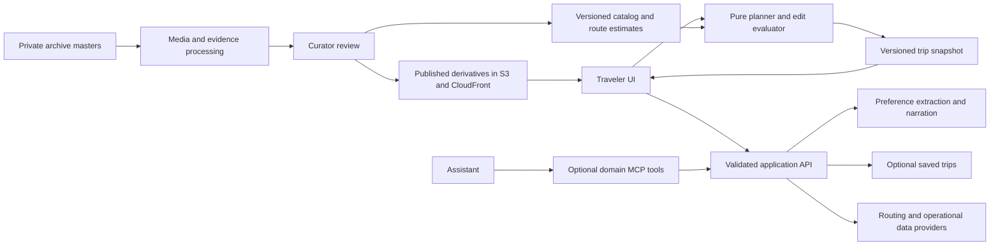

# Engineering and integration audit — 2026-09-12

Recommendation: keep the deterministic planner, React/Vite frontend, and Vercel application hosting. Complete the S3/CloudFront media integration, strengthen state and API contracts, and introduce external data through versioned inputs. AWS is most valuable here for the archive pipeline and routing; MCP is valuable for assistant access to operations and, eventually, to the planner itself.

This audits the working tree, including the uncommitted media publisher and `infra/` stack. It is a recommendation document, not a deployment or implementation change. Earlier audit documents describe different snapshots; findings below were checked against current code.

## What is solid

- Scheduling stays in deterministic TypeScript. AI interprets a brief and narrates a computed day. Preserve that boundary.
- Cities have a common contract, explicit experience variants, opening rules, and provenance. The city validator catches cross-reference errors that TypeScript assertions cannot.
- The planner harness exercises all three paces, multiple presets, closures, edits, and timezone determinism. This is a meaningful foundation, though it does not establish complete product correctness.
- The media stack uses a private S3 origin, CloudFront origin access control, HTTPS, versioning, retained storage, and stack termination protection. The publisher has an explicit asset allowlist and opt-in deletion.
- The archive evidence scripts keep metadata-derived proposals separate from curator decisions. That is the right basis for automation.

## Verified scope and checks

| Check | Result |
|---|---|
| Application TypeScript + production build | Passed; bundle-size warning |
| City validation | Passed for Paris and Rome |
| Planner smoke suite | Passed, including timezone checks |
| Route rendering and redirects | 19 checks passed; server rendering, not browser interaction |
| Media URL smoke | 3 checks passed |
| Runtime media manifest | 94 Paris files, 299.6 MiB |
| Infrastructure TypeScript | Passed |
| CDK synthesis | Passed using `cdk synth --strict --app 'node --import tsx bin/copy-my-trip-media.ts'`; the normal command hit a sandbox restriction on the tsx IPC socket |
| Separate API TypeScript check | Passed; currently absent from the normal app build |
| Targeted offline probes | Confirmed malformed-body failures, narration-key collisions, inferred “measured” legs, and one generated-day replay mismatch |

No live model calls, deployed browser tests, AWS account inspection, CDN range-request checks, or dependency vulnerability audit were performed. Hosted rate limits and other account-level settings remain unverified. No cloud resources were created or changed.

Current data: Paris has 127 places, 33 verified places, and 37 authored media descriptions; Rome has 42 places, none verified, and 42 descriptions. Media occupies about 535 MiB locally; 115 media files are tracked in Git. Vite copied the public assets into an approximately 591 MiB local build directory. The main JavaScript chunk is 517.78 kB uncompressed / 158.94 kB gzip; the separately loaded Mapbox chunk is 1,859.16 kB / 518.66 kB gzip.

## Findings, in recommended order

### 1. Put a server-owned boundary around paid model calls — high priority

Evidence: [extraction handler](/Users/brendan/Desktop-2026/copy-my-trip/app/api/extract-preferences.ts:64), [narration handler](/Users/brendan/Desktop-2026/copy-my-trip/app/api/narrate-day.ts:47).

Both handlers accept anonymous POSTs with no application-level quota, concurrency control, or request identity. Extraction accepts the caller's place catalog; it limits the number of places but not each name or ID. Narration accepts essentially any object as facts and truncates serialized JSON at 6,000 characters, potentially cutting a field mid-value. Both parse string bodies outside their `try` blocks. An offline call with malformed JSON rejected with `SyntaxError` before either handler sent a response. Both also return excerpts of raw provider errors.

Before broad public use, introduce shared runtime schemas, byte and field limits, structured public errors, explicit provider timeouts, and application usage limits. Load the catalog by an allowed `cityId` on the server. For narration, validate stop IDs and resolve authoritative notes/provenance from the published catalog; treat client times as client claims unless recomputed. Add request IDs and record model, prompt version, latency, token usage, and outcome without logging raw travel briefs by default.

An account login is not required merely to demonstrate the product, but an anonymous session must not confer unlimited paid inference. Rate limits and enforced usage ceilings control spending; budget notifications alone do not. Evaluate a smaller extraction model against a labeled brief set before changing models. Model names should be configuration, with the chosen version recorded in results.

### 2. Persist the trip independently of accounts — high product priority

Evidence: [TripContext](/Users/brendan/Desktop-2026/copy-my-trip/app/src/state/TripContext.tsx:43).

`PERSIST = false`. A refresh discards the trip, and the current storage key is actively removed. This is intentional in the source, but contradicts the README's localStorage description. A URL such as `/paris/itinerary/1` identifies a screen, not a saved itinerary.

First add a versioned local draft with runtime validation, migration rules, and an explicit reset. Local persistence can truthfully say “saved on this device” without implying an account. Provide export/import or a printable itinerary. Add server persistence when cross-device access, sharing, or multiple saved trips becomes a real requirement.

Persist a `TripSnapshot` containing schema version, engine version, catalog version, routing-data version, inputs, seed, edits, and current output. Saved plans should remain readable when the catalog changes; updating them should create a new revision with an explained diff. This gives support and integrations something stable to reference.

### 3. Make travel provenance describe the leg — high trust priority

Evidence: [travel calculation](/Users/brendan/Desktop-2026/copy-my-trip/app/src/lib/planner.ts:276), [visible label](/Users/brendan/Desktop-2026/copy-my-trip/app/src/components/DayTimeline.tsx:39).

Travel time uses straight-line distance, a walking speed, and a distance-based metro formula. A short walking leg becomes `measured` solely because both endpoint places are verified. No route measurement is required. A seven-day Paris probe produced ten such legs.

Immediately label these as estimates. Then model leg provenance separately: `observed`, `provider-estimated`, or `heuristic`, with supporting evidence or provider metadata. A photograph at each endpoint does not establish the route, speed, accessibility, or duration between them. This is particularly important because trustworthy provenance is the product's main differentiator.

### 4. Fix narration identity before adding more caching — medium priority

Evidence: [cache key](/Users/brendan/Desktop-2026/copy-my-trip/app/src/lib/narrate.ts:16), [cache consumers](/Users/brendan/Desktop-2026/copy-my-trip/app/src/pages/ItineraryPage.tsx:343).

The key contains only prompt version and `placeId@timeIn`. It omits date, city, experience ID, day number, purpose, and source-description changes. The memo is shared across the module. In an offline probe, the same day had the same key for September and December even though its sunset fact changed from 20:11 to 16:54. Changing an experience also kept the key unchanged.

Hash a canonical narration payload plus prompt/model/catalog versions. Use that key consistently in trip storage and in-flight deduplication. Scope private results by owner if introducing a server cache. Bound cache size and allow explicit retry after transient failure; `finished` currently memoizes `null` for the session.

### 5. Make edit warnings survive navigation, after fixing replay fidelity — high correctness priority

Evidence: [warning reset](/Users/brendan/Desktop-2026/copy-my-trip/app/src/pages/ItineraryPage.tsx:107), [append clears warnings](/Users/brendan/Desktop-2026/copy-my-trip/app/src/pages/ItineraryPage.tsx:230), [replay options](/Users/brendan/Desktop-2026/copy-my-trip/app/src/lib/planner.ts:773).

Warnings live in page state, are cleared on day changes, and are replaced with an empty array on append. The underlying violating plan can remain. Replay accepts date and weekday but cannot express all generation caps. The existing no-cap-flags test does not assert equality of replayed times.

A seven-day Paris first-time plan starting 2026-09-12, balanced pace, default stay, seed zero replayed day six with one changed arrival and zero warnings. This supports the caution already recorded in audit 05: blindly deriving warnings by replay is not yet safe.

Unify generation/edit constraints and represent scheduling decisions needed for replay, including day-trip returns and intentional waits. Assert unchanged arrival times and meaningful state equality over a broader replay suite. Then either derive warnings using that faithful evaluator or persist them against a specific plan revision and invalidate them whenever relevant inputs change.

### 6. Correct CDN cache semantics before media cutover — medium priority

Evidence: [publisher](/Users/brendan/Desktop-2026/copy-my-trip/app/scripts/publish-media.ts:94), [URL resolver](/Users/brendan/Desktop-2026/copy-my-trip/app/src/lib/media.ts:7).

The publisher uploads mutable original filenames with `public,max-age=31536000,immutable`, then invalidates CloudFront. Edge invalidation cannot clear an already fresh browser cache. Returning visitors can retain the replaced image for a year. AWS explicitly recommends versioned filenames for control over locally cached content. [CloudFront invalidation guidance](https://docs.aws.amazon.com/AmazonCloudFront/latest/DeveloperGuide/Invalidation.html).

Publish content-hashed paths and generate a runtime manifest that maps stable slot IDs to those paths. Upload assets first, validate them, then release the manifest/application. Keep previous releases available for rollback. A shorter browser TTL is an interim alternative if filenames must remain mutable.

The current `.vercelignore` exclusion is commented out, so the migration is not complete in source. Complete the documented verification sequence before enabling it: manifest coverage, image responses, content types, range-based video playback, and fallback behavior. Moving production delivery to S3 does not shrink Git history; separate the future master-archive workflow from Git as a later, deliberate change.

### 7. Give preference extraction explicit request ownership — medium priority

Evidence: [debounce and request state](/Users/brendan/Desktop-2026/copy-my-trip/app/src/pages/ComposePage.tsx:67), [fetch](/Users/brendan/Desktop-2026/copy-my-trip/app/src/lib/extract.ts:87).

Code inspection shows a race: request A is pending, the user types B, B's debounce fires while `extracting` is true and is discarded, then A updates preferences. The effect depends only on text, so finishing A does not necessarily schedule B. There is no extraction fetch timeout, stale-response guard, or visible retry, and a failed text is marked as already tried.

Use a request sequence or abort controller; only apply a result matching the current city and brief. Queue the latest text while busy. Preserve a manual retry and show a small “preferences could not be read” state. Verify this with delayed and failed mocked responses in a browser test.

### 8. Automate the checks that cover integrations — medium priority

Evidence: [TypeScript scope](/Users/brendan/Desktop-2026/copy-my-trip/app/tsconfig.json:21), [route smoke](/Users/brendan/Desktop-2026/copy-my-trip/app/scripts/route-smoke.tsx:1), [scripts](/Users/brendan/Desktop-2026/copy-my-trip/app/package.json:6).

The app build typechecks only `src`; esbuild transpiles scripts without checking their types. No repository GitHub Actions workflow was found. Route smoke tests render strings, so they cannot catch effect races, reload behavior, streaming, broken deployed routes, or CDN playback. The two APIs passed a separate typecheck during this audit, but the gate does not enforce that result.

Create separate frontend, server, and tooling TypeScript configs and a single CI verification command. Declare esbuild directly because project scripts invoke it. Add focused API tests and a small browser flow: compose, interpret a brief, choose, edit, navigate, refresh, and inspect narration failure. Add post-deployment checks for direct itinerary URLs, API health, and media delivery. Keep the existing planner suite; extend it where the probes found actual gaps.

### 9. Treat content freshness as a contract — medium priority

Evidence: [place and exception types](/Users/brendan/Desktop-2026/copy-my-trip/app/src/cities/types.ts:57), [entry provenance](/Users/brendan/Desktop-2026/copy-my-trip/app/src/cities/types.ts:146).

Ticket entries can record a URL and `asOf`; opening rules generally cannot record equally useful source and freshness information. A place-level `verified` flag cannot establish that today's hours or prices are current. Duration variance is missing for 78 Paris and 28 Rome places; the engine treats missing variance as zero. Ninety Paris places lack an authored description.

Represent operational facts with source URL/provider, observed time, validity period, and review state. Keep archive evidence distinct from operating information and live availability. Report missing duration confidence rather than inventing a variance. Prioritize depth for places actually selected in plans. Add a city IANA timezone before expanding beyond Paris/Rome: the solar-time helper currently assumes CET/CEST, and some compose copy still names Paris-specific attractions.

## Architecture to grow toward

Start with modules in this repository. There is no present need for microservices. Separate `contracts`, `planner`, `catalog`, provider adapters, and UI state by responsibility; promote them to workspace packages only when a second consumer needs them. Browser and server should import the same planner and contracts. An MCP adapter must call the same application operations.

External calls should produce a snapshot before planning, not occur during candidate scoring. A `RoutingProvider` can return duration, distance, geometry, mode, source, and fetch time. The engine consumes a resolved matrix with an explicitly labeled heuristic fallback. Network availability and model behavior should not silently change deterministic replay.

## Where AWS earns its place

| Capability | Useful when | Integration and benefit | Cost/complexity to accept |
|---|---|---|---|
| **S3 + CloudFront: finish now** | Already relevant: substantial photo/video assets | Complete the existing stack, hashed manifest, release checks, and retained masters. Separates application releases from media delivery. | Storage, requests, delivered bytes, cache behavior, and two hosting environments to operate. |
| **Archive processing: next when uploads recur** | Manual EXIF extraction, conversions, and slot mapping slow curation | Private upload → queue → metadata/derivative jobs → evidence proposals → curator approval → published manifest. This extends existing scripts rather than replacing their judgment. | Retry handling, job tracking, processing cost, and a review interface. |
| **Amazon Location: focused pilot** | Street-aware walking and transit estimates materially affect itinerary feasibility | Benchmark representative Paris/Rome legs behind a routing adapter; retain Mapbox rendering initially. Compare elapsed time, geometry, coverage, and departure-time sensitivity against current estimates. | Per-request usage, licensing/storage terms, API latency, fallback behavior, and regional coverage validation. |
| **Saved trips: when sharing/cross-device is needed** | Travelers need durable URLs, history, or collaboration | Add authenticated API access and ownership checks. DynamoDB suits known “user → trips” and “trip → revisions” access patterns; choose PostgreSQL if relational curation and reporting dominate. | Identity, authorization, migrations, retention, backups, and database operations. Local draft persistence should come first. |
| **Bedrock: conditional** | Central AWS model access and governance become useful | Put the existing model calls behind an adapter; evaluate Bedrock with the same extraction/narration acceptance set. | Model/region availability, feature differences, latency, and IAM setup. Do not assume cheaper calls or better results. |
| **AgentCore Gateway: later** | Several authenticated tools or external assistants need shared access | A managed gateway can expose and aggregate APIs/Lambda/MCP tools with authentication. | Another operational boundary; excessive for the two current model endpoints alone. |

Amazon Location now documents public-transit and intermodal routing through `CalculateRoutes`; the June 2026 release matters for this project's metro estimates. Validate target-city coverage and the exact API before adoption; do not assume route-matrix and individual-route modes are identical. [AWS transit announcement](https://aws.amazon.com/about-aws/whats-new/2026/06/amazon-location-service/amazon-location-new-public-transit-intermodal-routing/), [route matrix guidance](https://docs.aws.amazon.com/location/latest/developerguide/calculate-route-matrix-how-to.html).

For the archive pipeline, begin with the existing local conversion tools and an explicit job manifest. When moving work to AWS, make jobs idempotent using source object version/hash plus processing version: S3 notifications can duplicate and arrive out of order. Use small workers for bounded metadata/image tasks; evaluate MediaConvert or container workers for video processing. A queue and failed-job path are useful before a large workflow orchestration layer. [S3 event delivery](https://docs.aws.amazon.com/AmazonS3/latest/userguide/EventNotifications.html), [event ordering](https://docs.aws.amazon.com/AmazonS3/latest/userguide/notification-content-structure.html), [MediaConvert](https://docs.aws.amazon.com/mediaconvert/latest/ug/what-is.html).

Bedrock provides a common Converse interface across supported models; that does not remove the need to check each model's features and output behavior. [Bedrock Converse](https://docs.aws.amazon.com/bedrock/latest/userguide/conversation-inference.html). DynamoDB designs should start from actual access patterns. [DynamoDB modeling](https://docs.aws.amazon.com/amazondynamodb/latest/developerguide/data-modeling-blocks.html).

## MCP: three distinct uses

MCP standardizes how an assistant discovers and invokes tools. It does not itself provide hosting, storage, accurate facts, or permissions to commercial travel data. Fixed application workflows can call normal APIs directly; MCP becomes useful when an assistant must choose and combine capabilities.

**1. AWS development and operations — useful first.** The AWS Knowledge MCP server supplies current docs and regional availability without AWS credentials. It can help answer “Is this CDK origin-access pattern correct?” The managed AWS MCP Server also supports authenticated AWS operations under IAM, with CloudTrail visibility. It can help investigate “Why are these images returning 403?” or “What changed in this distribution?” [Knowledge MCP](https://awslabs.github.io/mcp/servers/aws-knowledge-mcp-server), [managed AWS MCP](https://docs.aws.amazon.com/agent-toolkit/latest/userguide/mcp-server.html).

For this project, begin with documentation access and narrowly scoped read access to the relevant distribution, bucket metadata, logs, and costs. Scope access to actual needed resources/actions rather than attaching broad administrator permissions. Keep infrastructure changes expressed in CDK and reviewed as diffs so the assistant does not create configuration drift. No AWS MCP connection was installed or used against an account during this audit.

AWS's older local `aws-api-mcp-server` is now explicitly superseded by its managed AWS MCP Server. Prefer the current setup/migration documentation over copying old local-server examples. [Official migration guide](https://github.com/awslabs/mcp/blob/main/src/aws-api-mcp-server/MIGRATION.md).

**2. A curator assistant — useful when maintaining the archive becomes repetitive.** Expose bounded tools such as `audit_city`, `find_unmapped_media`, `inspect_place_evidence`, and `propose_operating_fact_update`. The assistant could identify stale opening information, locate relevant photographs, and prepare a reviewable patch. Evidence retrieval should preserve source URLs, timestamps, asset IDs, and exact claims. Publishing and promotion to verified provenance remain explicit curator decisions. Keep private archive evidence out of traveler-facing tools.

**3. Your product as a tool — useful when another assistant should plan through Copy My Trip.** Expose `list_cities`, `get_place_evidence`, `generate_itinerary`, and `preview_itinerary_edit`. For example, “Move my museum to Thursday and preserve dinner” becomes a structured edit request; your engine produces feasibility warnings and a proposed diff. The assistant explains the result. Saving should be a separate operation with ownership checks and an expected revision, so a stale client cannot overwrite a newer trip.

Build these domain operations as ordinary typed functions/APIs first. Add MCP as a thin adapter when there is a concrete assistant client. AgentCore Gateway is an optional managed way to expose or aggregate them; it is not required to implement an MCP server. [AgentCore Gateway](https://docs.aws.amazon.com/bedrock-agentcore/latest/devguide/gateway.html).

Booking, calendar, and weather integrations need separate product decisions. Start with official booking links and calendar/export output. If adding live availability, distinguish an available slot from a confirmed reservation, record when availability was checked, and require an explicit booking action. Installing a developer connector does not automatically grant the deployed product commercial API access or access to its travelers' accounts.

## A practical sequence

1. **Reliability release:** local draft persistence, truthful leg provenance, narration-key fix, bounded and validated APIs, extraction request ownership, and automated gates. Acceptance: reload preserves work; malformed requests return controlled errors; changing date/experience invalidates narration; old responses cannot overwrite a new brief.
2. **Media release:** content hashes, manifests, CDN verification, scoped publishing credentials, and rollback. Acceptance: replacing an image changes its URL; every published slot loads; video range requests work; an old application release remains usable.
3. **Planner contract release:** shared generation/edit context, faithful replay, durable warnings, versioned snapshots, and fact freshness. Acceptance: unchanged replay reproduces the day; violations survive navigation; plans can identify their source-data version.
4. **One integration experiment:** compare real route estimates against a curated sample of current legs, or automate one archive upload batch through review. Choose the one with the greater observed user/curator friction. Measure the result before expanding infrastructure.
5. **Durable accounts and MCP distribution:** introduce saved-trip APIs when sharing is required, then expose the established domain API through MCP when an assistant client needs it.

Track media bytes delivered per completed trip, model calls/tokens per completed trip, narration cache hit rate, p95 response latency, rejected/failed provider calls, empty or infeasible days, and curator processing time per published place. Those measurements should drive AWS spending and architectural choices. There is no credible monthly cost estimate without traffic, viewing behavior, processing volume, and model usage assumptions.
