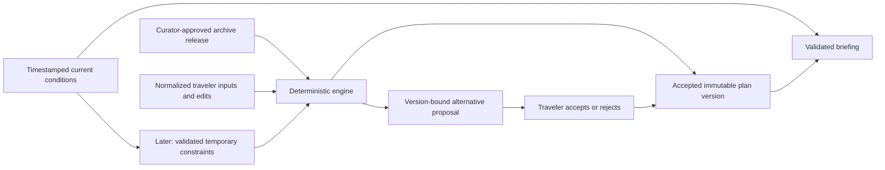

# 10 — Travel companion: repository reconciliation and implementation plan

Audit date: 12 September 2026. Repository base: `5d6c04b`, including the existing uncommitted work. **Status: design only; no application or infrastructure implementation authorized by this audit.** This document supplements, rather than replaces, plans 00–09 and the product principles. Proposed paths below do not yet exist unless explicitly described as existing.

## 1. Executive recommendation

Keep the React/Vite frontend, city archive, deterministic planner, maps, media pipeline, and separate curator pilot. Build an optional companion around an explicitly accepted, immutable itinerary. Do not rewrite the frontend or make a language model responsible for scheduling.

The blocking issue is the accepted-plan contract. Persistence is currently disabled, and replay is not lossless. An offline reproduction in this audit moved a Rome lunch from 12:03 to 09:18 when replaying the same stops. A Paris Versailles day lost part of its travel intent without reporting a warning. An email system built on regeneration would risk sending a different itinerary from the one the traveler accepted.

First establish snapshots, safe local restoration, and faithful editing. Then implement one complete experience: save a Paris plan, activate a verified recipient, select a nightly time, refresh weather, assemble and validate a deterministic briefing, send it, open the same briefing in the app, and record feedback. Use a sample trip and labeled simulations; recruitment is not a prerequisite. The schema must support any number of city segments, even though the first demonstration uses one city.

Use the existing Vercel deployment model, add Supabase Auth/Postgres for ownership and durable state, and use SES for email. A short cron-triggered worker with a Postgres job/outbox table is sufficient initially, subject to the hosting plan supporting the required schedule. Keep existing S3/CloudFront for public archive media. Defer private document storage until uploads, and defer EventBridge/SQS/Lambda until their operational benefits justify them. No nightly model call is needed for the first release.

## 2. Repository inspection coverage

The [coverage ledger](10-companion-audit-coverage.md) records files, exclusions, verification commands, and limitations. All relevant runtime source, both API routes, both city datasets, first-party scripts, the curator pilot, infrastructure source, and current build-plan documents were read. Historical reference architecture/logic documents were also read and treated as superseded proposals. The design prototype and generated support bundles were sampled, not treated as runtime code. Media manifests and metadata were inspected, with representative images viewed; binary media were not exhaustively reviewed.

No applicable `AGENTS.md` was found. Existing uncommitted files were preserved. Credentials were not read; only example environment configuration and source references were inspected. No paid AI calls, email sends, media publication, provisioning, or deployments were performed. Local tests do not establish the configuration of the actual Vercel, AWS, Supabase, or OpenAI accounts. No new browser/mobile end-to-end verification was performed; route checks render on the server.

## 3. Verified current architecture

| Area | Actual implementation and evidence |
|---|---|
| Frontend | React + Vite + TypeScript. [main.tsx](../app/src/main.tsx), [App.tsx](../app/src/App.tsx), [Vite config](../app/vite.config.ts), [package scripts](../app/package.json). City routes include home, compose, itinerary/day, archive, and neighborhoods, with legacy redirects. No Next.js runtime. |
| State | [TripContext](../app/src/state/TripContext.tsx) stores one working trip per city in memory. `PERSIST = false`; loading removes `cmt-trips-v3`, and the persistence effect exits. Dormant restoration uses JSON parsing/default padding rather than a validated versioned migration. |
| City boundary | [types](../app/src/cities/types.ts), [registry](../app/src/cities/index.ts), [Paris adapter](../app/src/cities/paris/index.ts), [Rome adapter](../app/src/cities/rome/index.ts). Static JSON includes places/experiences, hours, entries, provenance, neighborhoods, media, and curated days. Only Paris and Rome are registered. |
| Generation | [planner](../app/src/lib/planner.ts) and [presets](../app/src/lib/plan-presets.ts) deterministically rank and schedule from supplied inputs. No network calls in the engine. Five preset definitions exist. Date, weekday, seed, pace, purpose, exclusions, and experience selection matter. |
| Composition/editing | [ComposePage](../app/src/pages/ComposePage.tsx) extracts preferences and presents candidates; [ItineraryPage](../app/src/pages/ItineraryPage.tsx) recomputes/replays and edits days. [DayTimeline](../app/src/components/DayTimeline.tsx), maps, and reconsideration components provide reusable presentation. Accepted full outputs and their complete execution context are not persisted. |
| Travel/time | Distance-based walk/metro estimates; straight map lines, not routed transit legs. Static weekly hours and date exceptions. [sun.ts](../app/src/lib/sun.ts) has European offset assumptions; city data do not provide a general IANA-zone contract. |
| AI preference extraction | [client](../app/src/lib/extract.ts) and [API](../app/api/extract-preferences.ts): Anthropic, narrow structured extraction followed by client-side vocabulary/ID normalization. Anonymous public endpoint; no application-level account authorization, rate quota, or durable cost tracking. |
| AI narration | [client/cache](../app/src/lib/narrate.ts) and [API](../app/api/narrate-day.ts): Anthropic narrates supplied day facts. Viewing/prefetching an uncached itinerary can trigger calls. Optional rendering has no complete deterministic companion fallback. |
| Archive/media | [ArchivePage](../app/src/pages/ArchivePage.tsx), [media resolver](../app/src/lib/media.ts), [HeroPhoto](../app/src/components/HeroPhoto.tsx), [ImageSlot](../app/src/components/ImageSlot.tsx), manifests, media audit/evidence scripts. Paris has actual assets; Rome is researched content without archive plates. |
| Curator pilot | [pilot plan](08-curator-review-pilot.md), [observations](09-pilot-observations.md), [review implementation](../app/scripts/review/core.ts). Local CLI/server, Agents API research, structured proposals, citation validation, snapshot hashes, recorded decisions, and a separate verification pass. No canonical publication. Local disk persistence is suitable for this pilot, not a distributed traveler service. |
| Infrastructure | [CDK media stack](../infra/lib/media-stack.ts): private encrypted S3 origin, public CloudFront viewer delivery, origin access control, retained/versioned objects. [publisher](../app/scripts/publish-media.ts) checks a manifest then uses AWS CLI. No trip backend, auth, scheduler, weather integration, email, or monitoring implementation exists. |
| Build/deployment | App root is `app/`; Vite development alone does not serve Vercel API functions. README deployment assumptions require the corresponding Vercel root/configuration. Build TypeScript scope excludes API routes. No repository CI workflow was found. Cloud deployment settings were not inspected. |

Archive counts are claims about this checkout, not current operating coverage:

| City | Parent places | Marked firsthand | Marked web | Declared photo-bearing places | Curated days |
|---|---:|---:|---:|---:|---:|
| Paris | 127 | 33 | 94 | 33 | 4 |
| Rome | 42 | 0 | 42 | 0 | 0 |

Eight Paris places marked verified have no local files in their declared slots: Café Hugo, Ten Belles, Rue des Rosiers, Rue Mouffetard, Shakespeare and Company, Canal Saint-Martin, Père Lachaise, and Marché d’Aligre. The publication manifest contains 94 assets, about 299.6 MiB. File presence, GPS, or EXIF dates alone do not prove every editorial or operational claim.

## 4. Documentation/code discrepancies and engineering consequences

| Claim/expectation | Verified discrepancy | Required response |
|---|---|---|
| Local trips survive reload | Persistence is explicitly disabled; the current key is removed on initialization. README/current-state persistence descriptions are stale. | Implement validated local snapshots and migration before advertising saved trips. Never promise recovery of data already deleted by the current loader. |
| A saved set of stops reproduces the accepted day | Replay omits parts of generation context and implicit waiting/return travel. Targeted fixtures below drift. | Restore immutable accepted output directly. Repair replay separately; block unsupported replay instead of silently using today's engine/data. |
| Editing preserves the selected plan's intent | `commitDay` clears `planId`; subsequent `dayPlanContext` loses preset-derived purpose/avoidance/ranking context. Stored day paces can also override a newly selected global pace. | Separate origin preset from edited status and persist resolved per-day inputs. Define which controls apply to one day versus the whole trip. |
| Regeneration never calls a model again | Pure engine generation does not; itinerary viewing/prefetch can call narration for a new content key. | Explain that boundary accurately. Cache by complete immutable facts, and make narration optional with deterministic fallback. |
| Narration cache identifies the full day | Key uses stop IDs and arrival times, omitting city, date, experience, durations, context, and source versions. | Hash a normalized facts envelope. Add bounded lifetime/storage and retry behavior instead of permanent failed/null results. |
| Firsthand counts appear on days | Count-label helpers exist in [built-day.ts](../app/src/lib/built-day.ts) but are unused by the inspected runtime. | Render actual stop/experience-level counts in timeline, briefing, and email. Avoid granting an interior experience firsthand status merely because its exterior was photographed. |
| Every verified place has displayed evidence | Eight verified place slot groups contain no local assets. Some experience descriptions/narration inherit parent archive descriptions inappropriate to the experience. | Curator-controlled evidence remediation; show evidence unavailable where appropriate. Keep witnessed scope and researched experience facts separate. |
| Measured versus estimated legs are distinct | Planner `measured` is inferred from verified endpoints, walk mode, and short distance; this is not a measurement trace. | Add explicit leg evidence/source fields. Default heuristic travel to estimated; reserve measured for an attributable observed leg. |
| Ticket windows are reservations | The planner can select a suggested timed slot; UI wording can suggest “your slot.” No booking record proves purchase. Pins are best-effort scheduling preferences. | Label suggested times as unbooked. Later bookings require hard constraints and explicit infeasibility handling. |
| End-time checks establish arrival home | Some checks bound venue departure, with approximate travel and individual overrun checks rather than all accumulated uncertainty. | State the limited guarantee; represent return legs and usable day windows before claiming home-by or connection protection. |
| Date range supports arbitrary stays | State derives nights from date subtraction and clamps to 1–7; checkout is excluded and arrival is treated as usable without flight constraints. | First release visibly supports 1–7 planned days per segment. Reject unsupported ranges; define arrival/departure windows before extending duration. |
| Two-city UI is generalized | Engine takes a city adapter, but hero assets/captions and some composition copy remain Paris-specific. Rome has no archive photos. | Move optional hero/editorial copy into city presentation data and provide honest researched-only fallbacks. |
| Data validation proves factual currency | Structural validators pass despite internal editorial conflicts: Pantheon description says free while entry data indicate €5; Pompidou renovation copy coexists with normal indoor scheduling. | Flag for curator review. These are internal contradictions, not fresh verification of current operations. Add cross-field checks where meaningful. |
| A published media URL can safely change bytes | Publisher uses mutable keys with a year-long immutable cache policy. CloudFront invalidation does not clear browser immutable caches. | Use content-addressed filenames/manifest versions or revise cache policy before relying on updated email media. |
| Production build checks the backend | App `tsconfig` covers frontend; API routes required a separate strict check during this audit. | Add an explicit API check to repeatable gates and CI. |

**Replay reproductions.** With the first preset, seed `0`, balanced pace, first-listed stay neighborhood (`city.hoodOrder[0]`), arrival `2026-09-12`, seven days, and no interests, replaying the generated stop/experience references with date/weekday produces: Rome day four lunch `12:03 → 09:18`, plus meal/best-time flags; Paris day six Versailles dinner `19:40 → 19:37`, with its prior five-minute walk replaced by an 87-minute metro estimate and no replay flags. These fixtures belong in future regression tests. They do not negate existing smoke checks; those checks do not assert a complete no-op round trip.

## 5. Reconciliation matrix

“New” paths in this table are proposed modules, not existing implementations.

| Capability | Existing implementation | Decision | Reason / likely affected modules |
|---|---|---|---|
| Archive discovery and maps | ArchivePage, ArchiveMap, ImageSlot, city manifests | Reuse + extend | Preserve archive-first product; add explicit missing evidence, scope, and firsthand counts. |
| Multi-city trip setup | City registry; separate city working state | Extend | Add journey/segment wrapper, not a global Paris/Rome switch as the trip model. Modify TripContext/ComposePage; new `src/lib/trips/` and `src/pages/SavedTripPage.tsx`. |
| Dates, pace, neighborhood, interests | ComposePage, DateRangePicker, extraction, presets | Extend | Keep manual planning; make extracted values reviewable, prevent stale responses, expose correction/retry and explicit date limits. |
| Generation/editing | Planner, presets, ItineraryPage, ReconsiderDeck | Preserve + repair | Freeze complete context/output and fix replay before companion alternatives. |
| Pasted/uploaded bookings | None | Defer | Parsing requires review, privacy, and hard-lock scheduling; not needed to email an accepted plan. Proposed later `src/components/BookingReview.tsx`, server booking adapters. |
| Today view | Numbered itinerary day route | New small view | Resolve actual date in segment zone; states before/after trip, transfer day, no activity. Reuse DayTimeline. |
| Whole trip/activity details | Candidate previews, day timeline, maps | Extend | Add saved whole-trip overview and source/experience details using existing components. |
| Save and activate | No durable saved trip/account | New | Separate save from opt-in delivery; immutable snapshot and verified owner required. |
| Briefing/email preview | Narrated day screen only | New | One validated view model with HTML/text/app renderers; deterministic by default. |
| Alerts/source details | Static info and edit flags | New later | First release weather freshness card only. Operational alerts require scoped source adapters. |
| Before/after proposals | Reconsider alternatives within local edit UI | Extend later | Version-bound deterministic candidate, explicit diff/accept/reject, no background replacement. |
| Email/location preferences | Stay neighborhood only | New | Verified self-recipient, time/zone, pause; coarse destination location sufficient, GPS optional and deferred. |
| Demonstration trips | Curated Paris days/candidates | Extend | Frozen sample snapshot with relative-date fixture creation and isolated simulation markers. |
| Offline essentials | No explicit offline contract | New limited | Explicit local copy of accepted text itinerary; freshness/last-synced labels. Full offline map tiles/media deferred. |
| Feedback/problem reporting | None | New minimal | Useful/not useful plus optional private explanation, tied to briefing version. |
| Weather | None | New | Single typed adapter and expiring records; failure cannot suppress accepted itinerary. |
| Operational research | Internal curator Agents pilot | Reuse patterns later | Reuse schema/citation/budget patterns, not local synchronous server orchestration. |
| Transit-aware replanning | Heuristic travel and static venue hours | Defer | Needs service/route identity, temporary constraints, hard locks, waiting/return legs, and constraint-aware replay. |
| MCP | None | Defer | Useful later for scoped read-only catalog/conditions tools or developer diagnostics; direct typed APIs are simpler for the first slice. |
| Next.js rewrite, vector search, Kubernetes | None required | Reject for this plan | No demonstrated requirement; adds migration and operational cost without completing the companion. |

## 6. Non-negotiable boundaries

1. **Canonical archive:** Git-reviewed city JSON, media, provenance, and editorial judgments. Curator approval plus quality gates controls changes. A traveler action, weather fetch, agent output, or email job cannot write this layer.
2. **Traveler plan:** normalized inputs, frozen release references, resolved per-day context, engine output, accepted edits, and explicit constraints. Every accepted change creates a new version. Viewing a saved version does not regenerate it.
3. **Current conditions:** separate records with provider/source, retrieval time, observation/issue time if supplied, location/service scope, effective interval, expiry, and confidence/verification state. A historical visit never establishes current hours; a forecast is not an observed event.
4. AI may propose extracted values, research/classify evidence, or narrate validated facts. Deterministic code validates IDs, ownership, constraints, and output; only the engine computes schedules. Tool authorization is independent of model instructions.
5. First-release weather is advisory and cannot change the schedule. Later replanning freezes specific condition records and their normalized constraint set into the candidate's reproducibility envelope. Refreshing conditions is an explicit operation distinct from regeneration.
6. Keep original accepted output even when its engine release can no longer run. Show “viewable; regeneration requires review” rather than silently migrating. Retain executable engine/data releases for the declared reproducibility period.

Operational replanning specifically requires extending `planner.ts` inputs and replay to support expiring blocked experiences, reduced opening windows, unavailable travel services/legs, locked booking intervals, explicit waits/return legs, accumulated travel allowance, and arrival/departure availability. Match notices to stable place/experience IDs or actual service identifiers. City-level keywords are insufficient to declare a particular train or route disrupted. Impossible constraints must return an explanation and unplaced obligations, never quietly drop a booking.

## 7. Proposed frontend flows and states

**Anonymous discovery and planning.** Keep existing city pages, maps, date/pace/neighborhood selection, candidates, and manual editing usable without an account. Extraction remains optional; show pending/applied/failed states and reviewable fields. Ignore responses for superseded requests. A failed model request leaves manual controls usable. Move Paris-specific presentation into city data and label Rome as researched coverage.

**Accept, save, activate.** “Save this itinerary” captures the exact reviewed snapshot locally before sign-in. Validate and preview any surviving older local state, preserve a backup, and never replace it with an empty server record. After authentication, import with a client-generated import ID and explicit conflict choice; retries cannot create duplicate trips. Account creation alone does not activate email. Activation displays the recipient, nightly time/zone, tomorrow-date rule, coverage limits, and preview, followed by explicit opt-in. Verification pending, permission denied, quota exceeded, validation warnings, and network failure are visible states. Material infeasibility blocks activation; accepted advisory warnings remain attached to the plan.

**Saved journey.** Proposed `/trips/:tripId` shows segment dates, accepted version, whole-trip summary, sync status, and active/paused/completed status. `/trips/:tripId/today` resolves the relevant segment's calendar date and reuses the timeline. Activity details distinguish witnessed experience, researched details, estimated travel, suggested unbooked ticket times, and current conditions. Repeated visits to the same city use distinct segment IDs. First implementation can expose one segment while the storage/API support a segment array.

**Briefing and preview.** Proposed `/trips/:tripId/briefings/:briefingId` renders the exact sent version, delivery state, and sources. A banner links to the current accepted version if subsequently edited. Before a briefing exists: “scheduled,” “preparing,” or “not scheduled”; after weather failure: itinerary plus “weather unavailable” or explicit stale forecast timestamp. Preview uses the same validated render model; previewing does not send email. Loading never replaces saved content with a blank page.

**Preferences and feedback.** Self-recipient only initially, verified via auth; selecting a different email requires verification and pauses delivery until confirmed. Time and IANA zone are explicit. Pause stops new submissions, with an honest note that a submission already in progress may arrive. No location permission is necessary: destination coordinates support weather. Denied future GPS permission falls back to selected destination. Feedback offers a small usefulness control and optional issue text; submission errors preserve the draft.

**Later alerts and proposals.** A source drawer shows scope, date, last check, expiry, and limitations. A proposal compares old/new stop, time, travel, and reservation impact. Accept is an authenticated mutation against the exact base version; rejected/expired/superseded proposals stay distinguishable. No proposal silently edits a trip.

**Offline and mobile.** Offer an explicit device-local essentials copy with “saved at” and freshness labels. Initially cache itinerary text, addresses, source labels, and dates, not private uploads or entire maps. Show an offline fallback when maps fail. Scope local copies to the signed-in account and purge on logout; warn shared-device users before download. Future implementation acceptance includes narrow screens, touch targets, keyboard use, screen-reader labels, reduced motion, long city names, and network loss. Existing CSS and SSR tests are useful inputs, not proof of those behaviors.

## 8. Minimal backend and service architecture

| Service | First release responsibility | Decision / limits |
|---|---|---|
| Existing Vercel app/API | Serve current frontend; authenticated trip APIs; protected heartbeat/short worker; signed email-event endpoint | Keep. Add explicit server TypeScript checks. Worker must stop within a conservative runtime budget and leave work durable. |
| Supabase Auth + Postgres | Identity/verified email; owner-scoped saved trips; immutable snapshots; conditions; jobs/outbox; feedback | Add. Existing repository has no equivalent durable store. RLS supplements API authorization rather than replacing it. |
| Vercel Cron | Approximately five-minute UTC heartbeat to enqueue due work and drain bounded batches | Recommended if the account plan supports this frequency. Cron retries/duplicates cannot be treated as durable delivery guarantees. |
| SES | Submit HTML/plain-text transactional briefing emails | Add for actual email demo. Verify domain/sender and test recipient; broader recipients require appropriate account access. |
| SNS delivery-event transport | Carry SES delivery/bounce/complaint events to a verified endpoint | Small, justified addition for delivery state and suppression; not the general workflow queue. First submit can be tested before event wiring, but complete demo includes reconciliation. |
| Weather provider | Coarse destination forecast via a typed adapter | Add one, after terms/coverage choice. Cache by location, time window, variables, and provider. No traveler identity sent. |
| Existing S3/CloudFront | Public archive images/video | Reuse if configured; local media remains valid for development. No traveler documents in public CDN paths. |
| Supabase private Storage | Reviewed booking uploads with owner policies/short-lived access | Defer until bookings. One private document store; a separate private S3 design is an alternative, not an additional requirement. |
| OpenAI Agents API | Later bounded investigations; internal curator pilot remains separate | Not required for nightly accepted-plan/weather template. Persist asynchronous investigation state if added. |
| EventBridge + SQS + Lambda | Independent schedules, durable queue consumption, retries/DLQ, workers outside HTTP runtime | Defer. Adopt when worker runtime/backlog or hosting constraints justify it. Preserve the same job contract; do not run two competing schedulers. |
| MCP | Scoped tool interoperability or development diagnostics | Defer. A read-only catalog/condition server could serve multiple assistants later. Broad AWS account administration is not a traveler-facing tool. |

Vercel documents missed/duplicate cron invocations and no automatic retry of failed invocations, so the database must own due work, locks, and retry state. Hobby currently restricts each cron to once daily with hourly precision; minute-level scheduling requires a suitable plan. Account availability/cost is unverified. If that plan is unsuitable, select one alternative heartbeat (for example EventBridge) before implementation rather than secretly approximating users' requested times. [Cron management](https://vercel.com/docs/cron-jobs/manage-cron-jobs), [limits](https://vercel.com/docs/cron-jobs/usage-and-pricing).

EventBridge becomes useful for independent scheduling and AWS worker operations; SQS is useful when bursts or long work exceed bounded Postgres-backed draining, and Lambda hosts that consumer. It does not remove application deduplication or timezone decisions. EventBridge's native DST behavior can skip nonexistent local times, so preserve the chosen product semantics in the scheduling layer. [AWS schedule types](https://docs.aws.amazon.com/scheduler/latest/UserGuide/schedule-types.html).

MCP would become useful when the curator tool, companion investigator, and another client need the same scoped catalog/condition access. Candidate tools are read-only `get_catalog_release`, `get_place_evidence`, and `get_condition_record`; an investigator may return a proposed constraint as data for server validation. Reuse the existing schema and citation checks behind those tools. Introducing MCP now would not supply missing persistence, trustworthy facts, or a job queue. AWS MCP can help a developer inspect approved infrastructure or diagnose a failed worker, but it should use a separately scoped development identity and never expose account administration to a traveler or retrieved page.

A candidate weather provider is Open-Meteo, but its free API terms exclude commercial use, including product/promotion use; a prelaunch demo is not automatically exempt. Choose an appropriate commercial arrangement or another licensed provider, retain attribution, and verify destination/horizon coverage. Forecast data are not official disruption or severe-weather monitoring. [Forecast API](https://open-meteo.com/en/docs), [terms](https://open-meteo.com/en/terms).

## 9. Data models and API contracts

Names are design-level proposals. Use runtime schemas on both server ingress and persisted envelopes, plus database constraints. All timestamps are UTC instants except explicitly named local dates/times, which always carry an IANA zone.

| Record | Minimum fields and invariants |
|---|---|
| `trips` | `id`, `owner_id`, title, status (`draft/active/paused/completed`), `current_plan_version_id`, monotonic revision, created/updated/end instants. No uniqueness by city. |
| `trip_segments` | Stable `id`, trip ID, sequence, city ID, IANA zone, arrival/departure dates and explicit usable windows, stay area, normalized inputs. Repeated city IDs allowed. Initial engine bounds explicitly enforced per segment. |
| `planner_releases` | Engine semantic/build version, exact source/artifact hash, snapshot-schema version, city/catalog/media-manifest hashes, immutable artifact locations. Git HEAD alone is insufficient for a dirty checkout. Retain actual catalog inputs and executable release, not hashes without content. |
| `plan_versions` | ID, owner/trip, parent ID, release references, normalized inputs, seed, segment/day contexts, `originPresetId`, accepted edit operations, exact scheduled output, explicit wait/return legs, durations/time zones, selected experiences, constraints, warnings, provenance/media references, created/accepted times, content hash. Immutable after acceptance. |
| `notification_preferences` | Trip/owner, verified recipient identity reference, opt-in time, enabled state, nightly local time, delivery IANA zone, preference revision, next due instant, last service date, suppression state. Email address is resolved server-side from verified ownership. |
| `condition_records` | Provider/source URL, typed category, city/place/service/geographic scope, fetched/issued/observed timestamps where supplied, valid-from/to, expires-at, normalized payload and digest, adapter version, attribution, verification state, optional simulation namespace. Never a canonical place mutation. |
| `briefings` | Trip/owner, service date and zone, UTC target window, plan/prefs versions, frozen condition references, schema/template version, validated view model, content hash, ready/stale/failed state, created time. Sent versions remain immutable. |
| `jobs` | Type, trip, logical key, base revisions, due/available times, queued/leased/succeeded/retry/dead/cancelled state, attempts, lease expiry and fencing token, cost reservation/usage, safe error code. Unique logical key; claims atomic. |
| `deliveries` | Logical key `(trip, serviceDate, channel, kind)`, briefing ID, state (`pending/submitting/accepted/delivered/failed/unknown/suppressed`), attempt ID, provider ID, timestamps, provider-event IDs, safe reason. Normal nightly mail and explicit test mail use separate kinds. |
| `change_proposals` — later | Base plan version, condition/constraint IDs and expiry, engine release, computed candidate snapshot, structured diff, validation results, pending/accepted/rejected/expired/superseded state. Acceptance creates a new plan version atomically. |
| `investigations` — later | Job/trip/owner, provider session/operation IDs, allowed tools/source scope, input hash, deadline/call/token budget, pending/running/requires-action/completed/failed/deleting state, validated result reference and cleanup status. |
| `feedback` / `usage_events` | Owner/trip/briefing reference, usefulness/issue type, optional private text; separate minimal event/usage aggregates. No booking content, exact location, or email text in analytics. |

Store snapshots as a validated envelope (JSON is appropriate initially) with relational ownership/version indexes. Do not duplicate editable plan facts across independently mutable tables and JSON without an explicit source of truth. Conditions can be shared across trips when they contain no personal data; access to their association with a private trip remains owner-scoped.

Proposed API boundaries under existing `app/api/`:

| Contract | Behavior |
|---|---|
| `POST /api/trips` | Authenticated; validate/import local snapshot; client import idempotency key; server binds owner. Returns saved trip/version. |
| `GET /api/trips/:id` | Owner only; return accepted snapshot plus current state, never regenerated output. |
| `POST /api/trips/:id/versions` | Owner; expected base revision plus validated edit/snapshot input. Server verifies with the pinned engine contract; conflict returns `409`, not last-write-wins. |
| `POST /api/trips/:id/activation` | Owner; verified recipient reference, opt-in and preferences, expected revision. Validate deliverable plan/coverage and compute first due instant. |
| `PATCH /api/trips/:id/preferences` | Owner; revision-aware time/zone/pause changes; email changes require verified identity. |
| `GET /api/trips/:id/briefings/:briefingId` | Owner; exact briefing and safe source details. Email deep link may initiate sign-in, never an itinerary mutation. |
| `POST /api/trips/:id/preview` | Owner; returns deterministic preview or `202` + job URL if a provider refresh is required. Does not send. |
| `POST /api/trips/:id/test-delivery` | Owner; explicit action, self-recipient only, quota/idempotency key; distinguish from nightly mail. |
| `POST /api/trips/:id/feedback` | Owner; bounded structured values/text; preserve draft on failure. |
| `POST /api/trips/:id/proposals/:proposalId/accept` — later | Owner; compare base version, source validity, and constraint hash; recompute/validate under pinned release; atomically create version or reject stale proposal. |
| `GET /api/internal/companion-tick` | Protected scheduler credential; no user-selected trip/recipient. Enqueue/claim bounded work; recover expired leases. |
| `POST /api/events/ses` | Verify SNS signature, certificate URL/host, expected topic and event shape; deduplicate and apply monotonic delivery/suppression transitions. |

Prefer `404` for inaccessible objects and consistent validation errors without leaking another owner's identifiers. Authenticated responses containing trips must not be publicly cached. Use a same-origin authenticated client; if cookies are selected, add CSRF protections and appropriate cookie attributes. If bearer auth is selected, validate the token server-side and enforce a deliberate client/session policy. Never accept a client-provided owner or arbitrary destination email as authority.

## 10. Nightly briefing workflow

### Calendar contract

Recommended first-release rule: delivery follows one explicitly chosen **notification IANA zone**, initially the first destination's zone. The UI says, for example, “21:00 Europe/Paris, wherever you travel.” Do not silently use the browser zone or switch zones as the traveler moves. Following the destination automatically can be a later preference.

“Tomorrow” means the next calendar date in that notification zone. Store that service date and its UTC calendar window. Include accepted activities whose start falls in that window, while displaying each activity's actual local date/time and zone; include a labeled carry-over block for an overnight activity already in progress. A travel day may contain multiple segments. This avoids ambiguous duplicate or missing days when crossing time zones. Show explicit dates alongside “tomorrow,” especially when the segment date differs.

Compute next due times using IANA calendar rules, not `+24h`. Choose a documented DST policy: nonexistent selected time advances to the first valid instant; a repeated time sends once at the earlier occurrence. First UI can restrict nightly choices to evening hours, but underlying tests must cover both transitions. Schedule the evening before the first activity day, and stop after the last relevant briefing. If activation occurs after its cutoff, offer explicit preview/test delivery and schedule the next eligible night; do not backfill a pile of emails.

### Durable execution

1. **Activate:** atomically validate the current accepted snapshot, recipient verification, opt-in, revisions, trip dates, and quotas; compute `next_due_at`.
2. **Tick:** find due active trips and upsert logical jobs. Use a UTC heartbeat; scan for missed due work after outages. Proposed catch-up allowance is 60 minutes and before the target day starts; outside it, mark the missed send and retain an in-app preview rather than send an unexpectedly late email.
3. **Claim:** use a transactional claim such as `FOR UPDATE SKIP LOCKED`, a lease, and a fencing token. Duplicate cron invocations or expired workers cannot both finalize the same logical job. Bound batch size/runtime.
4. **Freeze:** read plan/prefs revisions and target date/window. Resolve accepted output directly; never re-plan it while preparing email.
5. **Refresh weather:** use destination coordinates only. Deduplicate across trips. Suggested initial policy: reuse a matching forecast fetched within six hours and covering the target window; short timeout (for example eight seconds) and at most one bounded retry. Keep provider-specific expiry/horizon validation separate from cache age. Mark expired fallback explicitly, or show “weather unavailable.” Do not suggest safety from missing warnings.
6. **Assemble:** deterministic date headings, accepted stop order/times, travel estimates, reservation status, warnings, appropriate archive images/captions, firsthand counts, researched labels, forecast summary, sources and timestamps, and app links. Use one typed view model for app, email HTML, and plain text. Use modest public JPEG renditions with descriptive alt text and an image-free fallback; do not embed video or imply an exterior photograph proves an interior visit. Model narration is omitted initially; any later optional prose has a deadline and validated fallback.
7. **Validate and persist:** IDs/references, order/times match the snapshot, provenance applies to the selected experience, imagery exists or has a fallback, sources/date windows are correct, and links/text are safe. Persist a ready briefing before submission. On schema/assembly failure, retry or surface failure; do not send fabricated content. Weather failure alone is not an assembly failure.
8. **Recheck and submit:** immediately before an atomic outbox claim, compare plan/prefs revisions, enabled status, trip completion, verification, and suppression. If edited before claim, invalidate the prepared briefing and rebuild against the new revision within the same logical delivery. Record `submitting` and an attempt tag before calling SES.
9. **Reconcile:** store provider acceptance separately from delivery. Signed events update delivered/bounced/complained states and suppress future mail as appropriate. Preserve the exact sent briefing. If the trip changes after the submission cutoff, show a newer-version banner in-app; do not automatically send a second nightly email.
10. **Finish:** advance the next due date, record job/provider cost and latency, and mark completed trips inactive. Delete/cancel/pause paths cancel queued jobs and prevent fresh claims. A submission already handed to the provider cannot reliably be recalled.

### Email uncertainty and retries

Postgres deduplication prevents routine duplicates but does not make an external email send exactly once. SES `SendEmail` returns acceptance, not guaranteed delivery, and its request does not expose an application idempotency token. A crash or timeout after submission may mean the email was accepted. [SES SendEmail contract](https://docs.aws.amazon.com/ses/latest/APIReference-V2/API_SendEmail.html).

Configure the send adapter so its SDK does not blindly retry ambiguous submissions. An uncertain attempt becomes `unknown`; reconcile matching provider events using attempt tags/provider IDs. Absence of an event is not proof that nothing was sent. Do not automatically resend unknown attempts. The in-app briefing remains available; an explicit resend, if later offered, must disclose possible duplication. Retry confirmed pre-submission failures with bounded exponential backoff/jitter; exhausted work becomes inspectable dead work. Fencing prevents an old worker from updating state, but cannot revoke an already dispatched network request; retain this limitation in tests and operations.

Editing after the final claim but before provider receipt is an unavoidable cross-system race. Define that claim as the submission cutoff, keep its exact version, and expose it honestly. Pause/delete prevents new claims, not an email already in flight.

### Later asynchronous investigations

Do not copy the pilot's long local request/poll loop into a Vercel request. Enqueue an investigation, initiate the provider operation, persist its ID, and return `202`. A bounded worker resumes by authenticated webhook or scheduled polling, verifies current job ownership/base revision, validates tool calls/results, and persists state before acknowledging progress. Enforce deadlines and call/token budgets and release cost reservations on terminal outcomes. Investigation failure yields a missing-update label, not an itinerary rewrite.

## 11. Security and operational requirements

| Boundary | Concrete requirement |
|---|---|
| Owner access | Validate authenticated user on every trip/version/document endpoint. RLS `USING` and `WITH CHECK` policies bind rows to owner; test all nested IDs and writes. Worker service credentials bypass RLS and therefore need explicit scoped job queries and authorization checks. |
| Existing public AI APIs | Add body/string/catalog limits, server-authoritative city vocabulary, request versioning, per-session/IP abuse controls, quotas, and redacted errors. Current token caps alone are not a spending limit. Preserve manual anonymous planning when these services are unavailable. |
| Secrets | Server-only OpenAI/Anthropic/SES/database service credentials; never `VITE_` expose them. Browser public configuration only where intended. Least-privilege worker IAM, no archive-write permissions for companion jobs. |
| Private uploads — later | Private bucket, owner-bound object paths and metadata, short-lived access, size/type checks and malware/content handling, parser isolation, explicit review before import. No uploads in public archive CDN; avoid email attachments containing booking documents. |
| Provider minimization | Weather receives coarse destination coordinates/date window. A model receives only necessary selected facts, not email, auth tokens, full trip history, passport/payment details, or raw uploads by default. |
| Untrusted content | Retrieved pages and booking text are data. Ignore embedded instructions; allowlisted tools/hosts, bounded fetch size/time, redirect and private-network protections, source validation, strict output schema, independent owner checks. No model tool for arbitrary email, SQL, filesystem, or city publication. |
| Webhooks | Verify signature against documented provider rules, expected topic/account and payload, permitted signing-certificate host, replay IDs/timestamps, and monotonic state transitions. Do not fetch arbitrary certificate URLs or confirm arbitrary subscriptions. Signed delivery transport still requires event ownership matching. |
| Rendering | Escape HTML and plain-text interpolations; validate URL schemes/hosts; no arbitrary generated HTML/Markdown execution. Email links use authenticated app views; accepting an itinerary change requires POST. No mutation on email GET, including automated link scanners. |
| Offline/session | No shared public caching of private responses. Explicit device-local copies, owner-scoped keys, bounded contents, logout/account-delete purge. No blanket service-worker caching of auth or booking endpoints. |
| Logging | Structured job/attempt IDs and safe reason codes; redact email, authorization headers, raw prompts, booking text, precise location, and signed URLs. Error messages must not echo provider secrets or arbitrary payloads. |
| Retention/deletion | Proposed starting policy: private trips until owner deletion; raw provider payloads seven days where terms permit; operational logs 30 days; normalized conditions and associations needed for accepted-plan reproducibility retained with the plan. No uploads in first release. Define backup expiry and deletion propagation, including model sessions and third-party logs, before promising deletion timing. |
| Spending and abuse | Per-user/trip active limits, global jobs/day and provider budgets, cache sharing, bounded retries, estimated-cost reservations and actual usage reconciliation by trip/job/provider. Hard model call/token limits plus an emergency disable switch. No claims of exact spend enforcement from output-token limits alone. |
| Operations | Monitor overdue jobs, lease expiry, dead work, weather freshness/failure, unknown submissions, bounces/complaints, delivery latency, and budget exhaustion. A small protected operations view is sufficient initially. Structured failures must be actionable without reading private itineraries. |

Supabase's service/secret credentials can bypass RLS; private storage also needs explicit policies. Neither auth nor database hosting supplies the application ownership model automatically. [Database RLS](https://supabase.com/docs/guides/database/postgres/row-level-security), [storage access controls](https://supabase.com/docs/guides/storage/security/access-control).

The OpenAI data-controls documentation currently lists Agents API application state as retained until deleted and not eligible for Zero Data Retention; abuse-monitoring retention is separately described. Do not assume sessions disappear when a job finishes or that account-specific controls are enabled. If the companion later uses Agents, track session cleanup and failures, minimize data, and verify the chosen endpoint/account policy before launch. MCP services have their own handling policies. [OpenAI data controls](https://developers.openai.com/api/docs/guides/your-data).

SES sandbox restrictions are regional and limit recipients and send rates; a verified self-recipient is enough for a personal demonstration, while broader delivery requires the appropriate access. Actual account state remains unverified. Configure bounce/complaint handling and sender authentication before recruitment. [SES sandbox/production access](https://docs.aws.amazon.com/ses/latest/dg/request-production-access.html), [SNS signature verification](https://docs.aws.amazon.com/sns/latest/dg/sns-verify-signature-of-message.html).

## 12. Phased implementation backlog

Each phase is an implementation proposal for a later authorized coding session. Keep changes reviewable; update stale authoritative descriptions explicitly during implementation, rather than silently treating this audit as a replacement.

| ID / dependency | Concrete work and likely paths | Acceptance criteria |
|---|---|---|
| P0.1 — first | Define accepted-plan envelope and validated migration. Existing `src/state/TripContext.tsx`, `cities/types.ts`; **new** `app/src/lib/trips/schema.ts`, `local-store.ts`, `snapshot.ts`. | Reload restores exact visible accepted output and edits. Unsupported/corrupt stored values are retained for recovery, not silently deleted. Import is idempotent. Seed fixed at plan creation. Storage denial/quota errors leave in-memory planning usable with clear unsaved state. |
| P0.2 — P0.1 | Preserve resolved day context, origin preset, pacing intent, waits/return legs, warnings, and explicit date windows. Existing `planner.ts`, `plan-presets.ts`, `ItineraryPage.tsx`, `ComposePage.tsx`; **new** snapshot/replay regression fixtures. | No-op round trip preserves stop/experience/order/times/durations/legs/context. Paris Versailles and Rome Testaccio regressions pass. Edits do not erase origin context. Unknown IDs/unsupported engine versions produce a migration/review state. Date bounds are visible and enforced. |
| P0.3 — parallel dependency within P0, before demo | Correct provenance presentation and API trust gaps. Existing `built-day.ts`, `narrate.ts`, `DayTimeline.tsx`, `Home.tsx`, `HeroPhoto.tsx`, city presentation data, both API routes. **New** API check script/config and CI workflow. | Experience-level evidence counts visible; heuristic legs labeled estimated; missing assets honest; suggested slots not called bookings; narration cannot reuse another city's/experience's cache. Stale extraction cannot overwrite later edits. Strict API check and request-limit tests join gates. Canonical factual corrections require curator review. |
| P1.1 — P0 schema | Add optional auth/database ownership and immutable releases. **New** `supabase/migrations/`, `app/server/auth.ts`, `app/server/trips.ts`, `app/server/db.ts`, `app/api/trips/` handlers; `App.tsx`/TripContext integration. | Cross-user read/write/nested-ID attempts fail; browser has no service secret. Save/restore uses snapshot, not generation. Anonymous local plans import once without loss. Old release remains viewable/reproducible within policy. Repeated-city segments work in schema tests. |
| P1.2 — P1.1 | Saved-trip overview, actual Today view, activation and preview preferences. **New** `src/pages/SavedTripPage.tsx`, `TodayPage.tsx`, `CompanionSettingsPage.tsx`; extend existing timeline/maps. | Save and email opt-in separate. Verified self-recipient only. Explicit time/zone/date preview, pause, end date, pending/error states. Works on narrow mobile screens and keyboard; anonymous composer remains usable. |
| P2.1 — P1.1/P1.2 | Durable scheduler, lease/outbox, calendar logic, budget and cancellation. **New** `app/server/companion/jobs.ts`, `schedule.ts`, `app/api/internal/companion-tick.ts`, proposed `app/vercel.json`. | Duplicate ticks create one logical job; concurrent workers fenced; missed ticks reconciled; bounded retries/dead state. DST gap/fold, 23/25-hour dates, travel days, late activation, trip completion and pause tested. Hosting frequency/runtime confirmed before enabling. |
| P2.2 — P2.1 | Weather adapter, condition store, deterministic briefing renderer/validator. **New** `app/server/conditions/weather.ts`, `app/server/companion/assemble.ts`, `validate.ts`, `app/src/lib/briefings/schema.ts`. | Accepted output unchanged. Weather timeout/stale/out-of-horizon all yield usable itinerary with accurate labels. Cache keyed by scope/window. All provenance and source timestamps survive JSON/app/email render. No model call or canonical write. |
| P2.3 — P2.2 | SES submission and signed event reconciliation; email/app preview plus feedback. **New** `app/server/companion/email.ts`, `app/api/events/ses.ts`, `app/src/pages/BriefingPage.tsx`, feedback API; deployment secrets and sender setup in later approved implementation. | One normal nightly send under duplicate workers. Unknown submission is not retried blindly. Bounce suppresses later sends. Edits before submission rebuild; edits after it preserve sent version. GET links cannot mutate trip. Actual verified self-recipient receives mail and opens the same briefing. |
| P2.4 — P2.3 | Sample trip, simulation harness, minimal operations/event view, local essentials export. **New** `app/src/demo/`, `app/scripts/companion-smoke.ts`, focused companion tests, protected operations UI. | Whole vertical slice demonstrable without recruitment. Simulated data labeled and isolated. Offline text works; logout removes account copy. Weather/model-disabled run still delivers. Feedback recorded; job latency/cost/errors inspectable. |
| P3 — successful P2 demo/results | Scoped operational source adapter and version-bound deterministic proposal. Extend planner constraint/replay contract; **new** `app/server/conditions/operations.ts`, `app/server/proposals/`, `src/components/PlanComparison.tsx`. | Source-to-place/service mapping validated, expiry enforced. Candidate never auto-applied. Stale base versions rejected. Hard obligations remain or infeasibility is explicit. No canonical writes. Synthetic disruption proves flow before real coverage claim. |
| P4 — demonstrated need | Booking paste/review, then private uploads and locked obligations; richer multi-city transfer handling and destination-following notifications. **New** booking parsing/storage/review modules and engine connection constraints. | Parsed values require user confirmation; private access/delete tests pass; timezone/overnight connection feasibility tested. Model cannot create accepted reservations or schedules. |

A compact regression suite should use shared fixtures for snapshot rendering and email, with real behavioral assertions rather than tests that merely mirror serialization code. Existing build/city/planner/route/media/review gates remain required. Add API typechecking to the standard commands; no dependency or lockfile changes were made for this audit.

## 13. Demonstration, coverage, and evaluation

### First complete demonstration

1. Open the Paris archive, inspect one firsthand stop and one researched experience, compose a four-day sample, and edit it.
2. Save, reload, and verify the exact accepted day survives. Sign in and import the local plan once.
3. Activate a verified self-recipient, choose time/zone, and inspect the date-specific email preview. Use an explicit test-delivery action for immediate demonstration; also run one real scheduled nightly send to verify scheduling independently.
4. Receive an email with archive imagery where available, correct provenance, estimated legs, forecast/source timestamps, and an authenticated in-app link. Open the identical briefing and submit feedback.
5. Simulate weather timeout, stale forecast, duplicate job delivery, edit during preparation, uncertain email submission, and trip completion. Confirm useful fallback and no routine duplicates or continuing sends.
6. Show a clearly labeled simulated closure and, only when P3 exists, a deterministic before/after proposal. Do not imply live operational monitoring from a simulation.

Use a namespaced demo flag and fixture-only condition records; synthetic conditions cannot affect real trips or canonical JSON. Relative-date fixture creation is explicit and creates a new snapshot; it is not a silent date change in a saved plan. A later multi-segment fixture should contain three segments including a repeated city to prove the model is not limited to two cities.

### Initial coverage register

| Coverage layer | Initial status/source | Freshness and limits | Failure behavior |
|---|---|---|---|
| Paris archive | 127 places, 33 marked firsthand; local media/catalog release | Historical visits; eight evidence-slot gaps; not current operating truth | Show available evidence and truthful missing-image/researched labels. |
| Rome archive | 42 researched places, no firsthand plates | Catalog editorial release only | Researched presentation; no fake Paris hero or firsthand count. |
| Basic companion | Initially Paris demo; later any explicitly supported segment with timezone/coordinates and provider coverage | Accepted snapshot + licensed forecast window; refresh policy and fetched/issued times visible | Deliver accepted plan with unavailable/stale weather label. |
| Local operations | None implemented | Add one named source/adapter at a time with place/service mapping, validity, checks, and limitations | “Not monitored” or “source unavailable,” never “all clear.” |
| Intercity connections | None implemented | Needs actual operator/service/date, connection windows, and authoritative source scope | Show accepted travel details and coverage limits; no invented monitoring. |

A future register record should contain city/segment or service scope, capability, source/adapter version, attribution/license, supported horizon, refresh cadence, last success, maximum age, known gaps, failure state, and whether it is synthetic. Planner support, archive depth, forecast availability, and live transport coverage remain separate dimensions.

### What the existing pilot does and does not establish

[Recorded pilot observations](09-pilot-observations.md) report 20 completed records, 19 proposals covering 39 field changes, and 23 accepted / 14 rejected / 2 deferred field decisions. The Notre-Dame record remains unresolved after blocked source retrieval and has no current proposal. The recorded 40 sessions include the failed-credit attempt/retry and verification work; aggregate usage was 3,359,748 input tokens (2,411,327 cached) and 40,083 output tokens. These are prior recorded results, not new calls in this audit.

The verification pass took roughly 13.5 minutes, but independent factual accuracy, manual-review time saved, and cost per accepted change remain unmeasured. There is no manual baseline, and model verification is not independent ground truth. Broad description rewrites performed poorly (12 of 16 rejected in the recorded review), supporting a narrow, fact-focused tool role rather than repeated editorial rewriting. Do not relabel automated acceptance as curator-certified accuracy or invent a baseline to complete a metric.

### Product hypotheses and minimal events

| Hypothesis | Events / observation | Interpretation |
|---|---|---|
| Archive motivates planning | `archive_open`, `compose_start`, `plan_generated` | Funnel into a meaningful plan, not raw page views. |
| Travelers want persistence/companion | `save_completed`, `companion_activated`, `companion_paused` | Separate save value from email opt-in. |
| Briefings are useful | `briefing_ready`, `briefing_open`, `feedback_submitted` | App opens/explicit feedback; no email tracking pixel. A self-demo proves functionality, not demand. |
| Operations change decisions | Later `proposal_shown/accepted/rejected/expired` plus reason category | Count actionable, relevant proposals; do not count synthetic events as user evidence. |
| Delivery is economical/reliable | `delivery_accepted/delivered/failed/unknown`, job usage/latency, provider failures | Cost per completed trip/briefing; later cost per accepted operational change. Include retries, failures, shared-source allocation, and allocated service costs. |

Use pseudonymous IDs, event time, template/engine release, coarse city, and outcome codes. Keep consent-sensitive feedback text private and separate; no email address, raw itinerary, booking reference, or precise live location in analytics. Establish retention and opt-out before broad collection. Pricing, marketing, distribution, and recruitment experiments follow a working demonstration.

### Verification completed in this audit

Production build, city validation, planner smoke suite, route smoke, media URL smoke, media manifest check, API strict typecheck, curator offline tests, and infrastructure typecheck passed. Media audit reported eight evidence gaps; evidence analysis produced 18 report-only proposals. Targeted replay inspection exposed the drift described above. See the [coverage ledger](10-companion-audit-coverage.md) for exact commands and limitations. These checks do not verify current place facts, live deployment settings, email delivery, browser/mobile behavior, or future companion code.

## 14. Assumptions and consequential open decisions

Proceeding assumptions for implementation planning: preserve Vite/React and existing principles; Paris is the first demo, not a hardcoded backend boundary; initial recipients are the owner's verified address; weather is advisory; no model call is needed nightly; no human review-time baseline exists; no canonical publication or live operations claim follows from the curator pilot.

Decisions to resolve before the corresponding implementation step:

- **Scheduling/service budget:** confirm Vercel plan and function limits, choose one heartbeat, select Supabase/AWS regions and account ownership, and set acceptable monthly/per-trip budgets. Existing deployment/account state is unknown.
- **Calendar semantics:** confirm fixed notification-zone delivery and the proposed travel-day definition, evening time range, late-send grace, initial segment day limit, and arrival/departure availability. These affect visible behavior and stored schemas.
- **Weather contract:** select a provider with appropriate product-use terms, attribution, forecast horizon, refresh policy, and acceptable cost. No free-commercial-use assumption.
- **Plan compatibility:** define release retention/reproducibility period and migration UX. Pinned hashes require retained artifacts; a new engine cannot silently reinterpret an accepted plan.
- **Identity/email:** confirm auth flow, sender/domain, regional SES access, verified-recipient behavior, suppression and account deletion policy. Self-testing can work before broad recipient access.
- **Privacy/retention:** approve actual retention and backup deletion windows, offline copy behavior, and future model endpoint/account settings before promising them to travelers.
- **Operational scope:** choose a specific source and exact supported places/services only after the basic demo. Whether bookings or live operations has higher value remains unproven; neither is required for the first slice.

These are recorded decisions for a later implementation session, not requests to interrupt this audit.

## 15. Explicit first-release exclusions

No frontend framework rewrite; no automatic city-data publication; no AI scheduling; no automatic itinerary replacement; no generalized European disruption monitoring; no train/flight tracking without service identity; no bookings or private uploads; no live GPS requirement; no vector database, Kubernetes, or multi-agent orchestration; no broad AWS MCP access; no separate queue stack without a demonstrated need; no full offline maps; no pricing/marketing prerequisite; no assertion of independently measured pilot accuracy or time saved.

The next implementation should deliver the accepted-plan/weather/email/app loop and its reliability tests. Persistence and replay repairs are prerequisites inside that delivery plan, not substitutes for the complete user experience.
