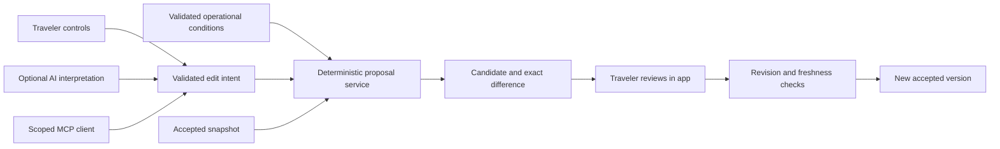

# 20 — Itinerary alternatives, AI editing, scoped MCP, and broader rollout

12 September 2026. **Planning document; these work packages are not implemented by this document. Commercial weather is deferred at the user's request.** This sequence supersedes the weather-first rollout sequence in plans 18–19. Existing weather code stays disabled and is not a dependency of alternatives, AI editing, MCP, or mail hardening.

## Outcome and order

**Implementation update:** package 1 is locally implemented and browser verified; see [plan 21](21-local-alternatives-verification.md) for exact scope, tests and screenshots. Packages 2–6 remain planned.

Give a traveler a useful answer to “this stop is closed” or “make tomorrow easier,” show exactly what would change, and replace the current accepted plan only after an explicit decision. Build this once as a shared proposal service. The app, a language model, and a later MCP client all use that service.

Recommended order:

1. **Local alternatives:** temporary constraints, deterministic candidates, readable differences, explicit acceptance, exact replay.
2. **Cloud proposals and verified conditions:** owner-scoped persistence, atomic acceptance, freshness checks, bounded source coverage.
3. **Rollout foundation:** fair mail scheduling, shared request/spend limits, monitoring, and recovery drills. Complete the existing two-email pilot independently before expanding real sending.
4. **Traveler AI editor:** translate a short request into validated edit instructions; reuse the proposal and acceptance flow.
5. **Scoped MCP:** let an authorized external assistant read a selected trip and request a proposal; finish acceptance in Copy My Trip.
6. **Invite-only rollout, then wider access:** expand according to measured reliability, quality, and cost.

Packages 2 and 3 can overlap once the local contract is stable. AI and MCP are optional interfaces; both depend on the same deterministic behavior and access controls. No commercial weather subscription, AWS expansion, or new agent framework is required to start.

## What already exists, and the gaps

| Area | Existing implementation | Work still needed |
|---|---|---|
| Planning | `planner.ts` has candidate filtering, `alternativesAt`, insertion/removal, sequence replay, timing and return legs | Shared time-scoped operational constraints; proposal-wide validation; hard commitments distinct from soft pins |
| Saved plans | Immutable accepted snapshots, parent history, compatibility gates, faithful display | Proposals separate from acceptance; stale-proposal handling; deterministic differences |
| Cloud | Supabase owner-scoped trips, revision conflicts, idempotent saves, deletion | Server-produced proposal storage and atomic acceptance against current trip/conditions |
| Email | Durable jobs, leases, submission reservation, idempotency keys, signed events, suppression and an approved single-owner pilot | Fair scheduling beyond the first 20 candidates; operational dashboards, recovery drills and capacity measurements |
| AI | Disabled preference extraction and narration routes; separate internal OpenAI curator workflow | Verified owner access, authoritative server context, bounded usage, traveler edit schema and evaluation |
| Conditions | Local weather adapter/cache/mail preparation, disabled; migration 004 unapplied | Operational sources and evidence review; source coverage/status; no live closure monitoring yet |

The planner's current `pins` are preferences, not proof of a reservation or a hard booking constraint. Current travel times are estimates. Existing catalog evidence does not establish today's operational status. Preserve these distinctions in both UI and validation.

## Shared architecture and contracts

**OperationalCondition v1:** identity/revision, city, place/experience or supported transport scope, affected time interval, IANA timezone, source URL and publisher, published time if known, retrieved time, expiry, normalized effect, verification state, and evidence reference. Distinguish verified, unverified, expired, retracted, and simulated. Store source coverage separately: no matching alert means “no alert in our checked sources,” not “everything is open.” Never invent an issue time.

**EditIntent v1:** a finite list of typed operations referring to existing trip segments, dates, stops and allowlisted catalog experiences. Initial operations: remove/replace a stop, include/avoid an experience, and change a supported day's pace/start time. Add moves across dates only after they pass the same replay and trip-wide checks. Carry an explicit clarification result when a request is ambiguous or unsupported. User-reported disruptions can guide that user's proposal, labeled as user-reported; they do not become verified public alerts.

**ItineraryProposal v1:** proposal ID, owner for cloud records, trip ID, base trip revision, affected segment/snapshot IDs, planner/catalog releases, condition IDs/revisions, normalized intent, complete candidate schedule, structured diff, warnings or infeasibility reasons, creation/expiry times, status, and acceptance result. Proposal expiry is the earliest applicable evidence expiry or a proposed 30-minute review window. A still-open screen does not extend it.

Candidate content is frozen at proposal creation. Acceptance creates the new immutable snapshot with acceptance metadata; it does not rerun planning and silently substitute a different candidate. The diff is derived from old and proposed schedules, including changed arrivals, departures, waits, travel mode/duration, return leg, removed/added experiences, and affected later stops. Include source reasons without implying that every difference was directly required by the closure.

Unchanged days remain unchanged. Validate trip-wide duplicates, affected neighboring segments, meal intent, date boundaries, opening windows, and any explicit hard commitments. Unsupported older releases remain readable/exportable and cannot be edited through this feature. If no feasible alternative exists, return that result with reasons; never hide a broken commitment to make a plan look complete.

### Acceptance transaction

For cloud trips, a dedicated authenticated endpoint accepts only a proposal ID, expected base revision, and idempotency key. The server derives ownership and reads its stored candidate. Under a consistent database lock order, check ownership/deletion, proposal status/expiry, base snapshot IDs/revision, release compatibility, and the condition-set generation for the affected city/date scopes. A new relevant condition must invalidate a proposal even if it was not in the original condition list. Condition publication and acceptance must serialize on that generation.

Append the new accepted version and update the trip revision and proposal result atomically. Concurrent acceptance of the same proposal returns the original result; acceptance of competing proposals produces a conflict. Rejection leaves the saved plan unchanged. A stale proposal requires a new preview and another explicit acceptance. Do not expose acceptance as an MCP tool in the first release.

Local-only users use the same pure proposal validation and snapshot logic with a compare-before-write check against the current local accepted version. Listen for cross-tab changes and invalidate open previews. Clearly distinguish “saved on this device,” cloud pending, conflict, and cloud saved; a failed cloud write must not be presented as synced. Existing sent briefings remain frozen; future unsent briefings can use the newly accepted plan through the current submission checks.

## Package 1 — Local alternatives and review UI

**Deliverable:** from a saved Paris itinerary, preview a closure scenario, choose from at most three deterministic alternatives, review the changed schedule, and accept or keep the original. Simulation controls are development-only and visibly labeled throughout the preview. Production can support traveler-requested changes without claiming live closure coverage.

| Files | Tasks |
|---|---|
| New `app/src/lib/conditions/operations.ts` | Runtime-validated condition/effect contract, interval overlap, scope and freshness rules; no network requests |
| `app/src/lib/planner.ts` | Thread constraint checks through candidate construction, alternatives and replay; apply effects to the relevant experience/time window, not every experience at a venue |
| New `app/src/lib/proposals/{schema,build,diff,validate}.ts` | Pure bounded proposal pipeline, stable ordering, full replay validation and machine-readable differences |
| `app/src/lib/trips/{schema,snapshot,local-store}.ts` and `app/src/state/TripContext.tsx` | Explicit proposal acceptance and base-version checks; preserve original accepted versions; persist pending local proposals separately if needed |
| New `app/src/components/{ItineraryProposal,ProposalDiff}.tsx`; saved/itinerary pages | Explanation, sources, two or three candidates, warnings, acceptance and keep-original actions; keyboard/mobile support |
| New `app/scripts/proposal-smoke.ts`; existing companion tests | Determinism, scope, incompatibility, replay and acceptance regression coverage |

Prefer the smallest feasible change, then fewer removed stops and lower extra estimated travel, using stable tie-breaking. Ranking is a documented policy, not a model decision. An interior closure can still allow a separately supported exterior experience; partial-day windows must be checked at the actual scheduled visit time.

**Exit gate:** browser-verify closure → preview → reject with unchanged snapshot, then preview → accept → reload with exact displayed timings and accessible history. Test partial closure, expired evidence, conflicting constraints, no feasible option, unchanged later days, meal/return preservation, stale tab, quota failure, and unsupported release. Mark a user-declared fixed appointment as a hard commitment only once its explicit constraint can be enforced; otherwise explain that limitation and block any claim that it is preserved.

## Package 2 — Cloud proposals and verified operational sources

**Deliverable:** the same flow works across devices, and a small documented set of official sources can support real closure alternatives.

| Files | Tasks |
|---|---|
| New `app/server/proposals.ts`, `app/api/proposals.ts`, client module under `app/src/lib/cloud/` | Authenticate; load saved trip and catalog on server; create/read/reject/accept proposals; enforce body/result bounds and operation idempotency |
| New Supabase proposal/conditions migration | Owner-scoped proposal table, condition records and scope generations, atomic acceptance RPC, deletion cascade and expiry cleanup; restrict condition writes to a separate worker capability |
| New `app/server/conditions/{operations,sources}.ts` | Allowlisted adapters with response/time bounds, normalization, freshness, source health and retractions; retain bounded evidence needed to audit a claim |
| New condition fixtures and proposal database/hosted smoke scripts | Concurrent acceptance and source publication, cross-owner denial, expired/new evidence, deletion, unknown schema and idempotent retry |

Start with a handful of Paris venue sources whose scope and machine-readable behavior can actually be verified. Record allowed use, update method, refresh interval, freshness limit, and supported experience mapping before enabling an adapter. Where structured feeds are absent, prepare a cited internal review item; do not treat a model's reading of a page as automatically verified. Automate retrieval/validation and reserve human review for uncertain mappings, conflicts or editorial decisions.

Transport alerts need a supported route/segment mapping before affecting feasibility. The current heuristic metro estimate cannot prove that a particular train or connection operates. Unsupported disruption reports can display a scoped advisory but must not produce an invented delay or a guarantee of arrival. Live operational alerts are independent of weather; weather predictions do not establish venue closure.

Fetch only allowlisted sources through server adapters; constrain redirects, protocols, response size, time and frequency. Source content and model-generated URLs cannot expand that allowlist. Keep temporary conditions separate from curator-controlled city JSON. Start with in-app alerts; any new disruption-email feature needs its own opt-in, deduplication and delivery policy.

**Exit gate:** two owners cannot read or accept each other's proposals; a changed trip or newly published relevant condition blocks stale acceptance; duplicate clicks create one version; deleted trips cannot be resurrected. Stale/unavailable sources visibly reduce coverage. Browser-verify cloud conflict recovery and exact accepted-version display on a second session.

## Package 3 — Rollout foundation

Keep Supabase's durable mail jobs and the existing Vercel cron initially. Fix the observed scheduling boundary before increasing recipients: candidates are currently ordered by preference update time and capped at 20, with at most two attempts per tick. Older candidates can repeatedly occupy the scan.

| Work | Implementation target | Acceptance evidence |
|---|---|---|
| Fair scheduling | Add indexed `next_due_at`/service-date scheduling or a persisted equivalent, stable keyset order, bounded batches and locking; update when trip/preferences change. Extend `notifications.ts`, `jobs.ts` and a new mail migration | More than 20 active trips; overlapping ticks; due work behind non-due work; no starvation. Cover destination/notification zones, DST, repeated cities, missed ticks and expired service windows |
| Recovery and retries | Preserve durable submission reservation, lease fencing, unique logical jobs and provider idempotency. Retry bounded preparation failures with backoff/jitter; reconcile uncertain sends by job/provider events before any resend | Crash before reservation, after reservation, after provider acceptance, and before finish. No duplicate user-visible email from retries or restore |
| Abuse controls | Shared server-side limits by owner and operation, bounded IP limits for unauthenticated entry points, payload/result ceilings, concurrency caps and feature allowlists | Parallel requests cannot exceed reserved quotas; unknown owners denied before model/provider calls; all public paid endpoints covered |
| Monitoring | Extend mail ops with counts by state, oldest due age, scheduler heartbeat, submission/delivery latency, webhook failures, source staleness and budget utilization | Controlled failure creates an actionable alert with a runbook link; recovery clears it; no tokens, email bodies or full trip content in logs |
| Cost accounting | New usage ledger for AI/source operations: operation/provider IDs, model/config versions, token usage, reserved/settled estimated cost, latency and outcome | Atomic reserve before work; no fresh charge on duplicate operation; unknown outcomes remain conservatively reserved; reconcile estimates with provider records |
| Recovery procedures | New `build-plan/22-operations-runbook.md` during implementation; feature flags, global pause, rollback release, credential rotation, retention/deletion and isolated restore | Restore a backup into an isolated environment with outbound sending disabled; prove trip readability, ownership and job reconciliation before workers resume |

Do not promise exactly-once delivery across network failures. Maintain explicit `unknown` states and a review/reconciliation path. Define how late a nightly briefing remains useful; after that window, mark it missed rather than sending a stale batch. Keep suppression and pause checks immediately before submission.

**Suggested initial controls, to configure before enabling:** one active AI request per account, ten AI edits per account per day, a small invite allowlist, and an explicit global daily AI spend ceiling. The dollar ceiling depends on the evaluated model and cohort size; missing budget configuration keeps AI disabled. These are proposed defaults, not current measured capacity. Mail limits remain separate; the existing two-email authorization is not an ongoing cohort allowance.

Suggested pilot targets: zero unauthorized reads/writes and duplicate acceptances in tests; no duplicate visible sends in crash/retry drills; 95% of eligible mail submissions within ten minutes of schedule in a representative load test; an alert after two missed five-minute scheduler runs. Provider inbox delivery is measured separately. Adjust targets using results rather than claiming a production SLA.

Include account UX and frontend readiness in the rollout checklist: sign-in persistence/session-expiry behavior, recovery links, mobile acceptance/conflicts, keyboard focus, route-level bundle loading, and usable saved plans during AI/provider failure. Current in-memory authentication can require another sign-in after reload; resolve or deliberately communicate that behavior before recruitment.

## Package 4 — Traveler-facing AI editing

**Deliverable:** “Make tomorrow gentler, keep my 14:00 booking” produces either a feasible proposal preserving an explicitly recorded commitment or a clarification/infeasibility result. The model interprets the request; deterministic code computes times, eligibility and differences.

Build `app/server/ai/{edit-intent,provider,usage}.ts`, `app/api/edit-itinerary.ts`, and a compact request/clarification component connected to the proposal UI. The server loads the authorized base trip and a bounded relevant catalog. Never trust a client-supplied catalog, owner ID, opening hours or saved schedule as authoritative context. Before enabling paid AI, route the existing extraction/narration handlers through the same authentication and usage controls or leave them disabled.

Use one bounded structured-output call initially, with a fixed maximum output, timeout, schema validation, refusal handling and semantic validation. No autonomous search loop is needed for this task. Unknown IDs, contradictory requests and unsupported constraints produce clarification; model prose cannot label an unverified source as verified. Derive the final change summary from the computed diff so it agrees with the candidate.

OpenAI documents schema-constrained outputs, but schema conformance does not establish schedule correctness; the application still validates meaning and feasibility. [Structured outputs documentation](https://developers.openai.com/api/docs/guides/structured-outputs)

Keep the current provider choice behind a small adapter. Compare the existing Anthropic approach and an OpenAI implementation on the same fixtures before choosing; do not switch providers solely to introduce agents. Reuse the internal curator pilot's operational lessons—bounded work, citations, validation and cost records—without exposing its editorial privileges. A durable agent session becomes useful later for multi-step research with interruptions; the first edit flow does not require it.

**Evaluation gate:** at least 40 versioned cases covering ordinary edits, ambiguity, multilingual phrasing, conflicting commitments, prompt injection, invalid IDs, unsupported old releases and outages. Require zero accepted ownership/constraint violations in the test set; target at least 90% correct supported intent extraction before an invite pilot. Measure proposal acceptance, post-accept undo/correction, latency, total model spend divided by accepted changes, and failure reasons. Include rejected/failed attempts in total cost. Review-time savings remain unmeasured until a comparable timed manual baseline exists.

## Package 5 — Scoped MCP

MCP becomes useful when someone wants to work on their trip from an external assistant: “Read my Paris trip and suggest a quieter afternoon.” The in-app editor can call the proposal service directly; adding MCP there would add an unnecessary interface boundary.

First build a local development adapter with synthetic data, then a remote authenticated endpoint after the delegation flow is proven. Proposed modules: `app/server/mcp/{tools,auth}.ts`, a transport entry point appropriate to verified hosting support, and a user-facing connected-assistants consent/revocation screen. Choose the transport/SDK and deployment only after checking the target client's negotiated protocol and request-lifetime requirements.

| Tool | Scope | Result |
|---|---|---|
| `read_trip` | `trip:read`, selected trip grant | Minimal accepted schedule and version; omit email, exact home address and unrelated history |
| `list_places` | Catalog read for the selected trip's supported cities | Bounded existing experiences and provenance |
| `get_conditions` | Selected trip/city/date scope | Normalized evidence and coverage state |
| `propose_edit` | `trip:propose`, selected trip grant | Validated proposal, diff and app review link; shared quotas apply |
| `get_proposal` | Selected trip grant and proposal ownership | Existing proposal status and bounded candidate |

No tool to accept, publish canonical data, delete an account, send email, execute SQL or fetch arbitrary URLs. The review link is not an authorization token and cannot accept on GET. The traveler signs into the app, reviews the current candidate and accepts there. External assistants cannot self-attest that the traveler approved it.

Use expiring, revocable grants tied to selected trip IDs and narrow scopes; derive owner identity on the server and recheck grants on every call. Remote MCP needs a compatible OAuth authorization flow, protected-resource discovery and audience-bound access-token validation. Do not pass Supabase browser tokens or mail-worker secrets through as a substitute. Evaluate the existing identity provider's actual delegation support before selecting an authorization-server solution; do not assume ordinary Supabase sign-in alone supplies it. [MCP authorization specification](https://modelcontextprotocol.io/specification/2026-07-28/basic/authorization)

If OpenAI is the client, explicitly restrict imported tools with `allowed_tools` and use approval settings appropriate to sharing trip data. Provider tool approval and in-app itinerary acceptance remain separate controls. [OpenAI MCP guide](https://developers.openai.com/api/docs/guides/tools-connectors-mcp)

**Exit gate:** wrong audience, expired/revoked grants, changed trip scope, cross-owner IDs, prompt injection and oversized results all fail safely. Revocation takes effect on the next tool call. Local and MCP requests with the same intent/base produce equivalent proposals. Test disconnection/retry without duplicate model charges. No write to accepted plans occurs from an MCP invocation.

## Cloud services: when an addition is worth it

| Service/interface | Decision for this plan | Trigger to reconsider |
|---|---|---|
| Supabase + Vercel + Resend | Continue existing storage/auth/jobs/functions/mail architecture | Measured backlog, lock contention, runtime or availability requirements exceed the tuned implementation |
| AWS SQS + worker, optionally EventBridge scheduling | Defer; useful for separating backlog processing and independently scaling workers | Load tests show database scheduling/function bounds cannot meet the agreed latency target. Keep Supabase as the authoritative job ledger; migrate one dispatcher at a time |
| Scoped application MCP | Add after proposal service and delegated auth | A real external-assistant workflow needs selected-trip access |
| AWS/Supabase infrastructure MCP | Optional operator tooling only | Deployment/debugging benefits justify an audited operator integration; never expose infrastructure tools to travelers |
| Commercial weather | Deferred | User later chooses a provider/budget and resumes plans 18–19 |

SQS standard queues can deliver a message more than once, so moving to SQS would not remove the need for idempotency, leases and reconciliation. Queue messages should carry job IDs, not full private trips. [AWS delivery semantics](https://docs.aws.amazon.com/AWSSimpleQueueService/latest/SQSDeveloperGuide/standard-queues-at-least-once-delivery.html)

## Migration and release sequence

1. Preserve the current production pilot and its separate scheduled verification/pause/cleanup. This plan authorizes no additional messages or activation.
2. Build package 1 entirely locally with weather and AI disabled. No Supabase migration is necessary for the first demonstration.
3. Before the next database release, recheck remote migration history. If weather migration `202609120004_weather_cache.sql` remains unapplied everywhere, move it to a documented pending-weather location outside `supabase/migrations`, update its local test references, and preserve it for later rebasing. Never rename applied migrations. Do not run a bulk push that inadvertently includes deferred weather.
4. Add new uniquely ordered proposal/conditions, scheduling/usage, then MCP-grant migrations as their packages become ready. Exercise clean install and upgrade from applied migrations 001–003 in disposable databases. Verify RLS, capability separation and old-app compatibility in hosted preview before production.
5. Deploy preview with all new feature switches off, then enable only the package under test for allowlisted owners. Separate proposed controls: alternatives, verified operations, traveler AI, MCP, mail and weather. Database-backed pause/budget controls must take effect without waiting for redeployment.
6. Run UI/API/database end-to-end checks, restore/rollback drills and the versioned AI evaluation before extending access. Roll back code with new features disabled; retain accepted versions and compatible additive tables. Reconcile jobs before restarting any sender.
7. Expand from internal use to a small invite cohort, then broader rollout only after observed queue latency, error rates, source coverage, cost per accepted edit and recovery performance meet the agreed gates. Document what is actually live separately from prepared code.

## First coding assignment

**Implement package 1: a browser-verified local closure-alternative flow for one saved Paris day.** Include an all-day closure, a partial experience closure, expired evidence and no-feasible-alternative fixtures. Show up to three deterministic choices, their source/status and exact schedule differences. Require explicit acceptance, retain the previous version, reject stale previews and prove exact reload behavior.

Use existing styling and saved-plan controls. Deliver the new modules, focused regression checks and browser evidence. Weather, live source polling, paid AI, MCP and real email activation remain outside that first slice. Its proposal contract is the foundation for every later package.
